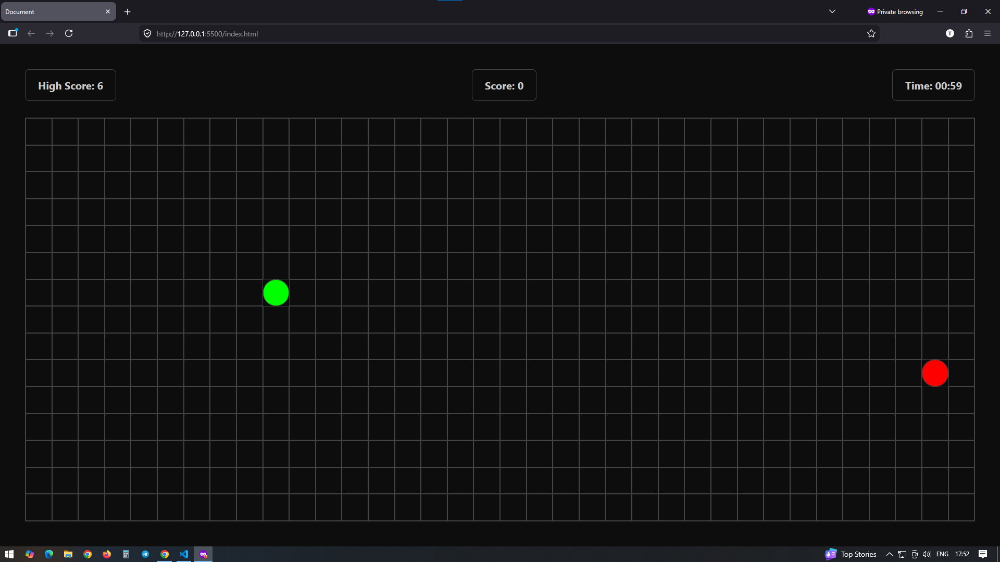

# 🐍 Snake Game (Vanilla JavaScript)

A modern and responsive Snake Game built using **HTML, CSS, and JavaScript**.  
This project includes features like score tracking, timer, and local storage for high score.

---

## 🚀 Features

- 🎮 Smooth snake movement
- 🍎 Random food generation
- 🧠 Collision detection (wall + self)
- ⏱ Countdown timer (60 seconds)
- 🏆 High score saved in LocalStorage
- 🔁 Restart game functionality
- 💡 Clean UI with popup screens

---

## 🛠 Tech Stack

- HTML5
- CSS3 (Grid + Variables)
- Vanilla JavaScript

---

## 📸 Preview

---

## 🎯 How to Play

- Press **Enter** or **Space** to start
- Use **Arrow Keys** to control snake:
  - ⬆ Up
  - ⬇ Down
  - ⬅ Left
  - ➡ Right
- Eat food to increase score
- Avoid hitting walls or yourself
- Game ends when:
  - Timer reaches 0
  - Snake collides

---

## 📂 Project Structure

├── index.html
├── style.css
├── script.js

---

## 💾 Local Storage

The game stores your **highest score** using browser LocalStorage.

---

## ⚙️ Future Improvements

- 🔊 Sound effects
- 📱 Mobile controls (swipe support)
- 🎨 Themes (dark/light)
- ⚡ Difficulty levels
- 🏆 Leaderboard system

---

## 🧑‍💻 Author

Developed by **Tafajjul**

---

## ⭐ Support

If you like this project, give it a ⭐ on GitHub!
